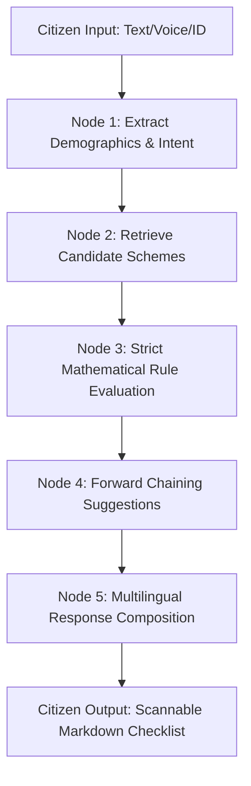

# Sarkari Sahayak — Master Technical Documentation & Architecture Specification

> **Digital Public Infrastructure for Social Welfare Discovery**  
> *Built with FastAPI, LangGraph, OpenAI gpt-4o-mini, Groq LLaMA-3.3-70B, Didit Protocol & Bhashini ASR*

---

## 1. System Architecture & Flowchart

## 2. Complete Step-by-Step Workflow of a Query

### Step 1: Citizen Interaction & Ingestion (Frontend)

The user submits a message via the web UI. This can be: a) Typed text prompt in Hindi/English/Hinglish, b) Recorded regional voice note (audio file), or c) Uploaded Aadhaar/ID card image. The JS event handler (index.js) creates a FormData payload containing the input, active phone session ID, and preferred language, and executes a POST fetch to /webhook/web/message or /webhook/didit/scan.

### Step 2: API Gateway Routing & Session Lookup (FastAPI)

FastAPI receives the request in backend/app/api/webhook.py. It queries Redis via SessionManager.get_session(phone) to retrieve the active user profile (if any exists). If an audio file was sent, it invokes Bhashini / Whisper ASR to transcribe the voice to text. If an ID photo was sent, it invokes OpenAI Multimodal Vision OCR to extract name, age, state, and ID number.

### Step 3: Initializing LangGraph StateGraph (graph.py)

webhook.py calls run_agent(user_query, extracted_profile, language) in backend/app/agent/graph.py. An initial GraphState dictionary is created containing: user_query, extracted_profile, candidate_schemes: [], eligible_schemes: [], suggested_schemes: [], reply_text: '', and preferred_language.

### Step 4: Node 1 — Extract Demographics & Intent (extract.py)

The state enters extract_profile_node(). First, extract_demographics_from_text() runs regex entity extraction for age (handles compound forms like 52-year-old, 52 saal), annual income (handles ₹1.8 lakh, 50k), land size (converts acres to hectares), and state (matches Devanagari and English states). Next, llm_extract_profile() classifies intent into SCHEME_QUERY, OFF_TOPIC, GENERAL_GREETING, or META_LANGUAGE_COMMAND, and sets the resolved language (hi, hinglish, en).

### Step 5: Node 2 — Vector Scheme Retrieval (retrieve.py)

The state transitions to retrieve_schemes_node(). It queries the VectorStore instance containing 125+ pre-seeded central and state schemes. Semantic cosine similarity matches candidate schemes based on citizen keywords (e.g. farmer, pension, health, solar, business loan).

### Step 6: Node 3 — Strict Deterministic Rule Evaluation (evaluate.py)

The state transitions to evaluate_rules_node(). Every candidate scheme is evaluated against the citizen's demographic profile using strict Python mathematical bounds: min_age / max_age (e.g. strictly disqualifies PM-KMY if age > 40), income_limit (disqualifies if income exceeds ceiling), max_land_size_hectares (disqualifies if land exceeds limit), and state residency. Qualifying schemes are scored and ranked via calculate_benefit_priority() (Cash 100pts -> Health 85pts -> Solar 70pts -> Loans 55pts).

### Step 7: Node 4 — Forward-Chaining Recommendations (chain.py)

The state transitions to forward_chain_node(). It applies domain heuristic linkages: qualifying for PM-Kisan automatically links Kisan Credit Card (KCC) and PM Fasal Bima Yojana (PMFBY).

### Step 8: Node 5 — Multilingual Response Composition (compose.py)

The state transitions to compose_response_node(). It formats the final response using OpenAI gpt-4o-mini (or Groq failover). The LLM follows RESPONSE_COMPOSITION_PROMPT rules to produce scannable Markdown bullet points with key benefits, exact eligibility rules, required physical documents (Aadhaar, Khatauni land record, Bank Passbook), and official portal links in the user's selected language (pure Hindi, Hinglish, or English).

### Step 9: Session Persistence & Client Delivery

The graph execution completes. webhook.py saves the updated profile, eligible schemes, and verified badge to Redis. FastAPI returns a JSON payload { status: 'success', reply_text: '...', session: { ... } } to the browser. The frontend appends the bot message to the chat feed and dynamically updates the Live Extracted Profile and Redis Memory Cache cards.

## 3. Technology Stack

| Component | Technology | Description |
|---|---|---|
| Backend Framework | FastAPI (Python 3.11+) | High-performance async ASGI web framework for REST endpoints and file uploads. |
| Agent Orchestration | LangGraph / LangChain | State graph framework providing cyclic stateful multi-step reasoning. |
| Primary Reasoning LLM | OpenAI gpt-4o-mini | High-intelligence multilingual LLM for JSON extraction and response synthesis. |
| Failover Reasoning LLM | Groq llama-3.3-70b | Ultra-low latency (500+ tokens/sec) inference for high-throughput failover. |
| Multimodal Vision OCR | OpenAI Vision API | Extracts real citizen credentials from uploaded Aadhaar/ID photo cards. |
| Identity Verification | Didit Protocol (OAuth2/SDK) | Zero-knowledge reusable identity verification and 1-click biometric claims. |
| Speech-to-Text (ASR) | Bhashini / Groq Whisper | Transcribes regional Hindi/Indian dialect audio notes to text. |
| Vector Database | pgvector / In-Memory Store | Cosine similarity vector retrieval over 125+ scheme embeddings. |
| Session Cache | Redis / In-Memory Cache | Ephemeral PII session store with auto-expiry (DPDP Act compliance). |
| Frontend UI | HTML5, Tailwind CSS, JS | Bilingual citizen playground with live diagnostics and audio recorder. |
| Testing Suite | Pytest, AnyIO, Asyncio | 24 automated test cases covering agent reasoning, extraction, and APIs. |
| Cloud Hosting | Render Cloud Platform | Containerized deployment with continuous git-based auto-deployment. |

## 4. API Endpoints

| Method | Endpoint | Purpose |
|---|---|---|
| `POST` | `/webhook/web/message` | Processes text messages or voice note uploads from the web UI. |
| `POST` | `/webhook/didit/scan` | Uploads identity card image; runs Vision OCR and runs scheme matching. |
| `POST` | `/webhook/didit/oauth/session` | Generates 1-click image-free Didit verification URL. |
| `GET` | `/webhook/didit/oauth/mock_verify` | Completes 1-click OAuth callback and updates profile. |
| `GET` | `/webhook/diagnostics/session/{phone}` | Returns active Redis session state for live debugging UI. |
| `DELETE` | `/webhook/diagnostics/session/{phone}` | Clears active session memory (privacy reset). |
| `GET` | `/health` | System liveness and readiness probe. |
