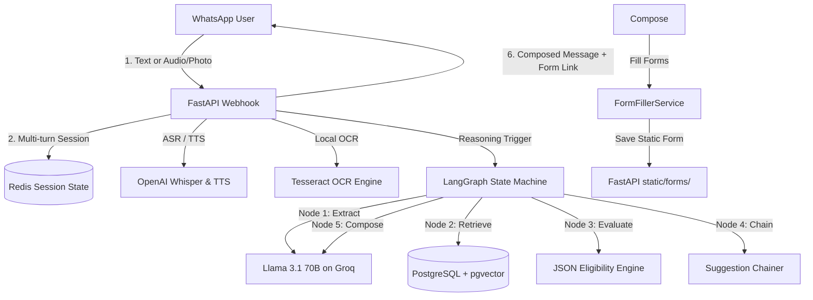

# Sarkari Sahayak — Agentic Welfare Scheme Navigator

[](https://render.com/deploy?repo=https://github.com/AdarshRai27/welfare-scheme-navigator)

---

### 🌐 Live Screening Prototype
Experience the live web simulator right now: **[welfare-scheme-navigator.onrender.com/static/index.html](https://welfare-scheme-navigator.onrender.com/static/index.html)**

---

Sarkari Sahayak is a multilingual, document-aware, agentic RAG system built to simplify access to government welfare schemes in India. Operating natively via a simulated WhatsApp interface, it allows rural and semi-literate citizens to speak or write their queries, upload identity/income certificates, verify eligibility, and receive pre-filled application forms.

---

## 💡 The Problem Statement
Accessing government benefits in India is plagued by high friction:
* **The Language Barrier:** Most portal search engines require precise queries, usually in English or formal Sanskritized terms.
* **Complex Eligibility Logic:** Finding whether one qualifies requires reading pages of fine-print rules (income caps, land size limits, age groups).
* **Document Literacy:** Filling out complex application forms with personal details is a barrier for millions.

Sarkari Sahayak resolves this by acting as an **agentic counselor** on WhatsApp—the interface users are already familiar with.

---

## 🚀 Key Features

* **🎙️ Multilingual Voice Processing:** Users can speak naturally in their local dialect. The system integrates **Groq Whisper (`whisper-large-v3`)** for transcribing audio notes and translates them into search vectors.
* **🪪 Privacy-First Document OCR:** Users upload photos of documents (like Aadhaar cards and Income Certificates). The system runs **Groq Llama 4 Scout Vision (`meta-llama/llama-4-scout-17b-16e-instruct`)** in the cloud to parse demographic variables. Sensitive PII is stored strictly in short-lived Redis session states and never persisted in database tables (Option A Privacy compliance).
* **🧠 LangGraph State Machine:** Uses a compiled graph architecture (`extract` ➔ `retrieve` ➔ `evaluate` ➔ `chain` ➔ `compose`) to run multi-turn conversational agents.
* **⛓️ Forward-Chaining Rule Engine:** When a user qualifies for a primary scheme (e.g., PM-Kisan), the engine automatically infers and suggests related schemes (e.g., Kisan Credit Card, Crop Insurance).
* **🔊 Keyless Speech Synthesis:** Bot counseling responses are synthesized back into fluent spoken audio using **gTTS** (Google Text-to-Speech) completely for free without key quota limits.
* **📋 Auto-Filled Application Forms:** Generates a downloadable, pre-filled application form in JSON structure using the profile data gathered during the chat, sparing the user from manual form filing.
* **💻 Interactive Demo Simulator:** Serves a side-by-side browser preview dashboard showcasing a simulated WhatsApp interface on the left and a real-time Redis cache JSON visualizer on the right.

## 🛠️ System Architecture



---

## 📂 Project Structure

```
├── backend/
│   ├── app/
│   │   ├── agent/           # LangGraph state machine & reasoning nodes
│   │   ├── api/             # Webhook routing & diagnostic endpoints
│   │   ├── db/              # SQLAlchemy models & pgvector VectorStore
│   │   ├── scraper/         # Scrapy spiders for MyScheme & State portals
│   │   ├── services/        # WhatsApp, OpenAI (Whisper/TTS), OCR, and FormFiller
│   │   └── core/            # Config settings and Pydantic schemas
│   ├── static/              # Holds pre-filled forms and the preview UI
│   └── tests/               # Test suites verifying the full system (18 tests)
├── infra/
│   └── docker-compose.yml   # Multi-service container definitions (DB, Redis, App)
├── deploy.sh                # Detached single-command production deployment script
└── README.md
```

---

## 🚦 Getting Started

### Prerequisites
* Docker & Docker Compose
* An OpenAI API Key (from [platform.openai.com](https://platform.openai.com/))
* A Groq API Key (from [console.groq.com](https://console.groq.com/))

### Production Launch
1. Copy the environment template:
   ```bash
   cp backend/.env.example backend/.env
   ```
2. Open `backend/.env` and paste your `GROQ_API_KEY` and `OPENAI_API_KEY`.
3. Launch the container network using the deployment pipeline:
   ```bash
   chmod +x deploy.sh
   ./deploy.sh
   ```
4. Access the visual simulator in your browser at:
   `http://localhost:8000/static/index.html`

### Local Development / Pytest
If running without Docker:
1. Initialize virtual environment and install dependencies:
   ```bash
   cd backend
   python -m venv .venv
   .venv/Scripts/activate
   pip install -r requirements.txt
   ```
2. Execute the test suite:
   ```bash
   python -m pytest tests/
   ```
